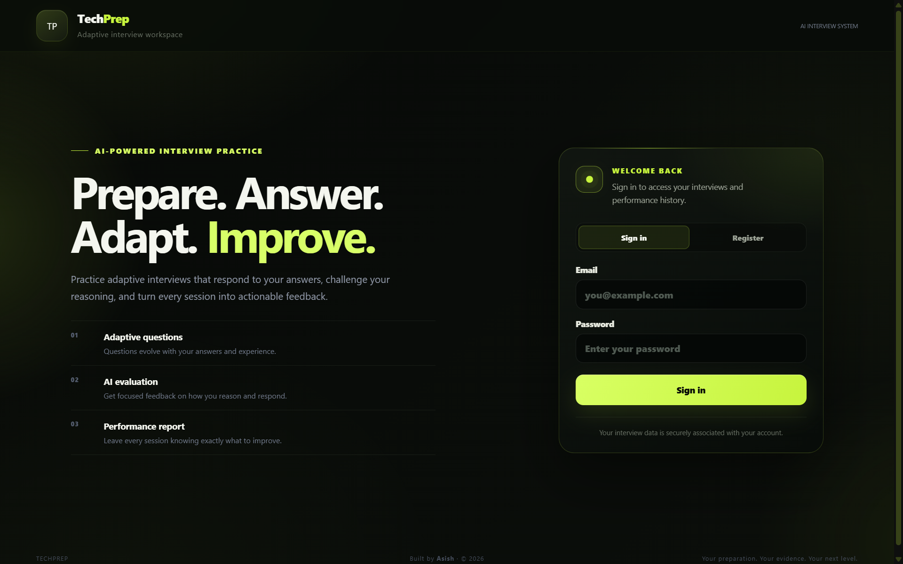
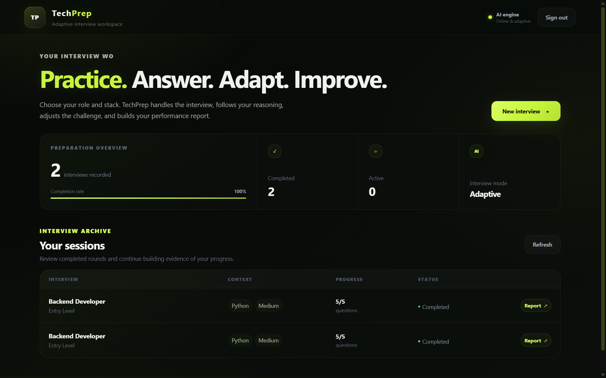
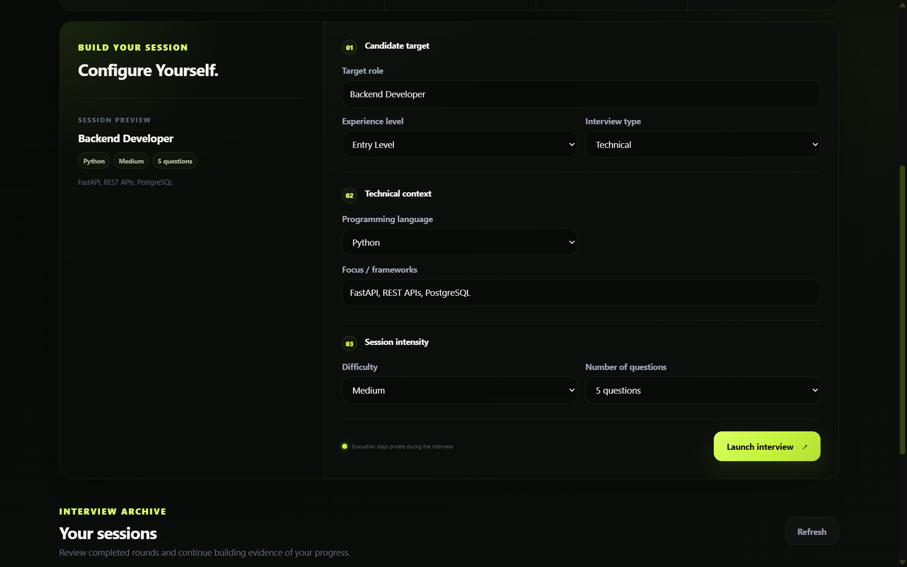
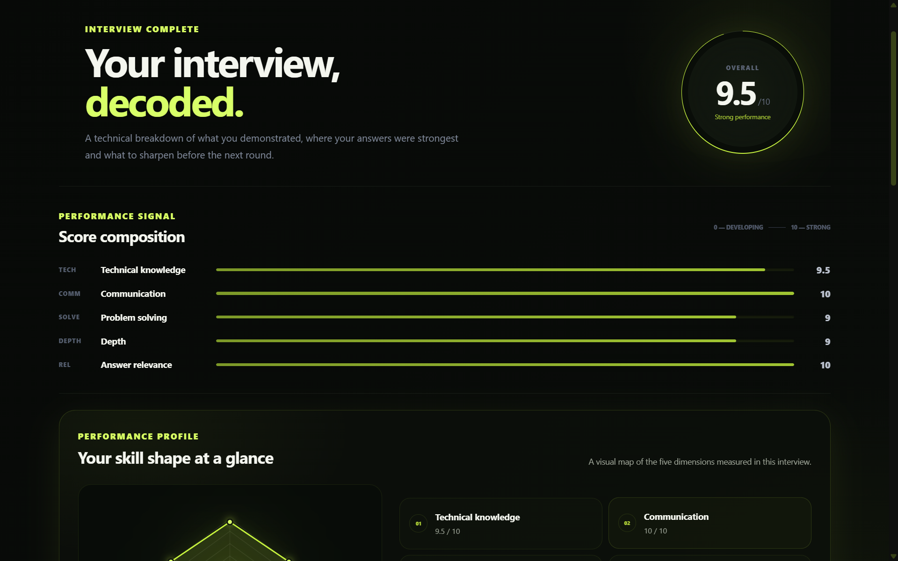
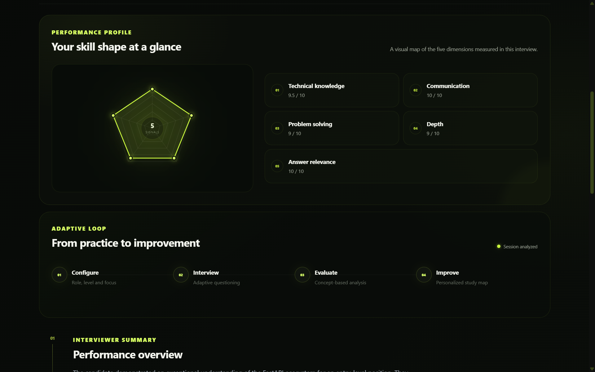

# TechPrep — AI-Powered Adaptive Mock Interviewer

TechPrep is a full-stack AI-powered mock interview platform built for technical interview preparation.

Instead of using a fixed question bank, TechPrep dynamically generates interview questions using AI, evaluates each response, adapts subsequent questions based on the candidate's performance, and produces a detailed performance report when the interview is complete.

The application combines a responsive React interface with a FastAPI backend, PostgreSQL persistence, secure authentication, and Google Gemini for AI-driven interviewing.

## Live Demo

**TechPrep:** https://ai-techprep.pages.dev

> The backend is hosted on Render's free tier. After a period of inactivity, the service may spin down and the first request can take additional time while the server wakes up.

---

## Screenshots

### Authentication

TechPrep provides a focused authentication experience with a responsive interface and clear access to interview preparation.



### Interview Dashboard

The dashboard provides an overview of interview activity, completion status, previous sessions, and access to generated performance reports.



### Interview Configuration

Candidates can configure each interview by selecting the target role, experience level, interview type, programming language, focus areas, difficulty, and number of questions.



### Performance Report

After an interview is completed, TechPrep generates a structured report covering technical knowledge, communication, problem solving, technical depth, and answer relevance.



### Performance Profile

The report includes a visual performance profile and presents the adaptive interview cycle from configuration through evaluation and improvement.



## Features

### Adaptive AI Interviews

TechPrep generates interview questions dynamically based on the candidate's selected:

- Target role
- Experience level
- Interview type
- Programming language
- Frameworks and focus areas
- Difficulty
- Number of questions

Questions are not selected from a static frontend question bank.

The AI receives the interview context and uses previous answers and evaluations to determine the next appropriate question.

### AI Answer Evaluation

Each submitted answer is evaluated before the interview continues.

The evaluation considers multiple aspects of the response, allowing the system to understand how the candidate is performing and adapt the interview accordingly.

### Adaptive Question Flow

The interview changes based on the candidate's responses.

Rather than following a predetermined sequence, TechPrep uses previous interview context to influence the next question while the backend maintains authority over the interview state.

### Performance Reports

After the interview is completed, TechPrep generates a structured performance report containing:

- Overall performance score
- Technical knowledge
- Communication
- Problem solving
- Technical depth
- Answer relevance
- Interviewer summary
- Strength signals
- Growth signals
- Concepts to revisit
- Recommended learning topics

Completed reports are stored with the interview and can be reopened later from the dashboard without generating the report again.

### Interview History

Authenticated users can access previous interview sessions from the dashboard.

Each completed session displays its interview configuration and provides direct access to the stored performance report.

### Authentication

TechPrep includes account registration and login with:

- Password hashing using bcrypt
- JWT-based authentication
- Protected backend endpoints
- User-specific interview history

### Responsive Interface

The interface is designed for both desktop and mobile use and includes:

- Authentication screens
- Interview dashboard
- Interview configuration
- Adaptive interview room
- AI analysis state
- Performance report
- Interview archive

### AI Reliability Handling

Temporary AI provider availability issues are handled with retry logic in the backend, reducing failures caused by short-lived model availability spikes.

---

## Tech Stack

### Frontend

- React
- Vite
- JavaScript
- CSS
- Fetch API

### Backend

- Python
- FastAPI
- Uvicorn
- JWT
- bcrypt

### Database

- PostgreSQL
- Neon

### Artificial Intelligence

- Google Gemini API
- Google GenAI Python SDK

### Deployment

- Cloudflare Pages — frontend
- Render — backend
- Neon — PostgreSQL database

---

## How TechPrep Works

The interview lifecycle follows this flow:

```text
Configure Interview
        │
        ▼
Create Interview Session
        │
        ▼
Generate AI Question
        │
        ▼
Candidate Submits Answer
        │
        ▼
AI Evaluates Response
        │
        ▼
Update Interview Context
        │
        ▼
Generate Adaptive Next Question
        │
        ▼
Repeat Until Session Is Complete
        │
        ▼
Generate Performance Report
        │
        ▼
Store Interview + Report
        │
        ▼
Review From Dashboard
```

The AI provides the interview intelligence, while the backend remains responsible for application authority.

This separation means:

**AI is responsible for:**

- Generating interview questions
- Evaluating candidate responses
- Adapting question direction
- Producing interview feedback

**Backend is responsible for:**

- Authentication
- Interview ownership
- Interview state
- Question progression
- Database persistence
- API validation
- Report storage
- Application flow

---

## Interview Configuration

Before starting an interview, candidates configure the session.

The configuration includes:

### Candidate Target

- Target role
- Experience level
- Interview type

### Technical Context

- Programming language
- Frameworks or focus areas

### Session Intensity

- Difficulty
- Number of questions

This context is supplied to the AI when generating the interview.

---

## Interview Experience

During an active interview, TechPrep presents one question at a time.

Candidates can provide technical explanations, keywords, pseudocode, or code depending on what the question requires.

After an answer is submitted:

1. The backend receives the response.
2. The AI evaluates the answer.
3. The interview context is updated.
4. The system determines whether another question is required.
5. If required, the AI generates the next adaptive question.
6. When the configured question count is reached, the interview is completed.
7. The final performance report is generated.

This creates an interview experience where later questions can respond to earlier performance.

---

## Performance Analysis

TechPrep evaluates the completed interview across five performance dimensions:

### Technical Knowledge

Measures understanding of the technical concepts discussed during the interview.

### Communication

Measures how clearly technical ideas are explained.

### Problem Solving

Measures the reasoning and approach demonstrated while answering questions.

### Technical Depth

Measures how deeply the candidate understands implementation details and underlying concepts.

### Answer Relevance

Measures how directly and appropriately the candidate responds to the question being asked.

The report also provides qualitative feedback including strengths, improvement areas, concepts to revisit, and recommended study topics.

---

## Project Structure

```text
ai-mock-interview/
│
├── backend/
│   ├── models/
│   │   ├── __init__.py
│   │   ├── auth.py
│   │   └── interview.py
│   │
│   ├── routes/
│   │   ├── __init__.py
│   │   ├── auth.py
│   │   └── interviews.py
│   │
│   ├── services/
│   │   ├── __init__.py
│   │   ├── ai_service.py
│   │   ├── auth_service.py
│   │   ├── context_service.py
│   │   └── report_service.py
│   │
│   ├── auth_dependency.py
│   ├── config.py
│   ├── database.py
│   ├── main.py
│   └── requirements.txt
│
├── frontend/
│   ├── public/
│   │
│   ├── src/
│   │   ├── api/
│   │   ├── pages/
│   │   ├── App.jsx
│   │   ├── App.css
│   │   ├── index.css
│   │   └── main.jsx
│   │
│   ├── index.html
│   ├── package.json
│   └── vite.config.js
│
├── .gitignore
└── README.md
```

---

## Backend Architecture

The FastAPI backend separates responsibilities across multiple modules.

### Routes

API routes handle incoming requests for authentication and interviews.

### Services

Business logic is separated into dedicated services.

`ai_service.py`

Handles communication with the Gemini API, interview question generation, answer evaluation, and AI reliability logic.

`auth_service.py`

Handles authentication-related application logic.

`context_service.py`

Builds and maintains the context required for adaptive interview behavior.

`report_service.py`

Handles final interview report generation and report-related processing.

### Models

Backend models define authentication and interview-related request and data structures.

### Database

PostgreSQL is used to persist users, interview sessions, responses, interview state, and completed reports.

---

## API Overview

The frontend communicates with the FastAPI backend through HTTP requests.

The API provides functionality for:

- User registration
- User login
- Creating interview sessions
- Retrieving interview history
- Submitting interview answers
- Progressing adaptive interviews
- Completing interview sessions
- Retrieving stored performance reports

Protected interview endpoints require authentication.

---

## Local Development

### Prerequisites

Make sure the following are installed:

- Python
- Node.js
- npm
- Git

You will also need:

- A PostgreSQL database
- A Google Gemini API key

---

## 1. Clone the Repository

```bash
git clone https://github.com/akrout9999-star/ai-mock-interview.git
cd ai-mock-interview
```

---

## 2. Backend Setup

Move into the backend directory:

```bash
cd backend
```

Create a Python virtual environment:

```bash
python -m venv venv
```

### Activate the Virtual Environment

On Windows PowerShell:

```powershell
.\venv\Scripts\Activate.ps1
```

On macOS/Linux:

```bash
source venv/bin/activate
```

Install backend dependencies:

```bash
pip install -r requirements.txt
```

---

## 3. Backend Environment Variables

Create a `.env` file inside the `backend` directory.

```env
DATABASE_URL=your_postgresql_connection_string
GEMINI_API_KEY=your_gemini_api_key
JWT_SECRET=your_secure_jwt_secret
FRONTEND_URL=http://localhost:5173
```

### Environment Variable Purpose

| Variable | Purpose |
| --- | --- |
| `DATABASE_URL` | PostgreSQL database connection |
| `GEMINI_API_KEY` | Authentication for Google Gemini |
| `JWT_SECRET` | Secret used to sign authentication tokens |
| `FRONTEND_URL` | Allowed deployed/local frontend origin |

Never commit actual API keys, database credentials, passwords, or JWT secrets to Git.

---

## 4. Start the Backend

From the `backend` directory:

```bash
uvicorn main:app --reload
```

The local API will normally be available at:

```text
http://127.0.0.1:8000
```

---

## 5. Frontend Setup

Open another terminal and move into the frontend directory:

```bash
cd frontend
```

Install dependencies:

```bash
npm install
```

Create the frontend environment configuration if required:

```env
VITE_API_URL=http://127.0.0.1:8000/api
```

Start the Vite development server:

```bash
npm run dev
```

The frontend will normally be available at:

```text
http://localhost:5173
```

---

## Production Environment

### Frontend

The production frontend is deployed with Cloudflare Pages.

```text
https://ai-techprep.pages.dev
```

The production frontend uses:

```env
VITE_API_URL=https://techprep-api-g0v5.onrender.com/api
```

### Backend

The FastAPI backend is deployed using Render.

```text
https://techprep-api-g0v5.onrender.com
```

### Database

Production PostgreSQL persistence is provided by Neon.

Sensitive production environment variables are configured directly through the hosting platforms rather than stored in the repository.

---

## Deployment Architecture

```text
                    ┌───────────────────────┐
                    │        User           │
                    └───────────┬───────────┘
                                │
                                ▼
                    ┌───────────────────────┐
                    │    Cloudflare Pages   │
                    │     React + Vite      │
                    └───────────┬───────────┘
                                │
                           HTTPS / JSON
                                │
                                ▼
                    ┌───────────────────────┐
                    │        Render         │
                    │       FastAPI         │
                    └───────┬───────┬───────┘
                            │       │
                ┌───────────┘       └───────────┐
                │                               │
                ▼                               ▼
       ┌─────────────────┐             ┌─────────────────┐
       │      Neon       │             │ Google Gemini   │
       │   PostgreSQL    │             │      API        │
       └─────────────────┘             └─────────────────┘
```

---

## Security

TechPrep keeps sensitive application responsibilities on the backend.

Security-related implementation includes:

- Password hashing
- JWT authentication
- Protected API endpoints
- User-associated interview data
- Backend-managed database access
- Backend-managed Gemini API access
- Environment-based secret configuration
- CORS configuration for permitted frontend origins

API keys and database credentials are never intentionally exposed to the frontend application.

---

## AI Reliability

External AI APIs can temporarily become unavailable during periods of high demand.

TechPrep includes backend retry handling for temporary AI service failures so short-lived provider errors do not immediately terminate an interview request.

The application still treats the backend as the authority for interview progression and persistence.

---

## Design System

TechPrep uses a dark technical interface designed around focused interview preparation.

### Primary Visual Direction

- Dark background
- High-contrast typography
- Acid-green accent
- Minimal technical interface
- Structured information hierarchy
- Responsive layouts
- Mobile-first refinements

### Core Colors

```text
Acid:          #c7f43d
Background:    #080b0d
Card:          #111619
Primary text:  #f4f6f1
Secondary:     #a7adb5
```

The visual system is carried consistently across authentication, dashboard, interview, loading, and report experiences.

---

## Key Engineering Decisions

### No Static Question Bank

Interview questions are generated dynamically rather than being selected from a hardcoded frontend list.

### Backend-Controlled State

The backend controls interview progression and persistence instead of trusting the browser to determine interview state.

### AI as Intelligence, Backend as Authority

The AI determines question and evaluation content, while application rules remain controlled by the backend.

### Persistent Reports

Completed reports are stored so users can reopen them without repeatedly calling the AI provider.

### Separation of Concerns

Authentication, interview context, AI operations, report generation, routes, and persistence are separated into dedicated backend modules.

### Responsive UX

The application is designed to maintain the complete interview workflow across desktop and narrow mobile displays.

---

## Current Scope

TechPrep focuses on text-based technical mock interviews.

The current version intentionally does not include:

- Voice interviews
- Video interviews
- Resume parsing
- Arbitrary code execution
- Live collaborative interviews

The focus is on delivering a reliable adaptive interview workflow with useful AI-generated feedback.

---

## Future Improvements

Potential future extensions include:

- Additional interview categories
- Expanded performance analytics
- Long-term progress tracking
- Interview comparison views
- More configurable evaluation dimensions
- Additional AI model support
- Improved accessibility
- Optional voice-based interview modes

---

## Built With

- React
- Vite
- FastAPI
- Python
- PostgreSQL
- Neon
- Google Gemini
- Cloudflare Pages
- Render

---

## Author

**Asish**

Built as a full-stack AI portfolio project demonstrating:

- Full-stack application architecture
- REST API development
- AI integration
- Adaptive application logic
- Authentication
- PostgreSQL persistence
- Responsive frontend development
- Production deployment
- Cloud environment configuration

---

## License

This project is currently provided as a portfolio and educational project.

---

**TechPrep**

*Prepare. Answer. Adapt. Improve.*
